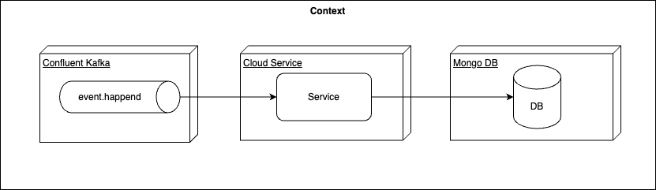

# .devcontainer

## Where Or When It Could Become Handy

### Task Of The Day

PoC implementation of service (Python) consuming Cloud Events from Kafka and persist this in a document database (MongoDB)

### Game Plan

1. Enable every contributor to develop Python (and ease documentation)
   - Ensure that all use the same Python Version
   - Find out how to deal with different Python versions, if somebody works in another project
2. Get a test topic on a kafka cluster for development purposes
   - Ensure every contributor gets an own topic to avoid side effects during development
3. Implement consume messages
4. Get a MongoDB test instance
   - Ensure every contributor can work with own test data
5. Implement DB write 

## Solution [-->](./docu/01.md)

