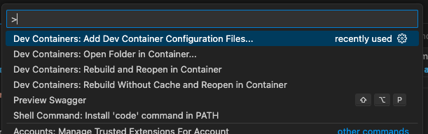

# Dev Container ... of course

> [Visual Studio DevContainers](https://code.visualstudio.com/docs/devcontainers/containers)
> 
> 

## Prequsits
- Docker Desktop
- IDE with remote coding support --> Visual Studio Code

## Let's Go
### With Visual Studio Code
- Ensure PugIn is there 
 
- Add Container [F1] 
   

Quick Wins [-->](03.md)