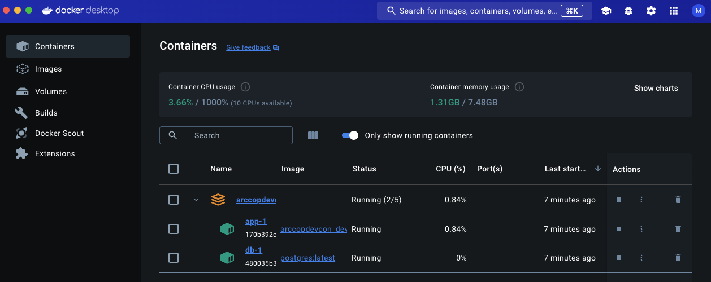

# What do we got
- Python (Anaconda) Environment
```docker
FROM mcr.microsoft.com/devcontainers/anaconda:0-3

# Copy environment.yml (if found) to a temp location so we update the environment. Also
# copy "noop.txt" so the COPY instruction does not fail if no environment.yml exists.
COPY environment.yml* .devcontainer/noop.txt /tmp/conda-tmp/

RUN if [ -f "/tmp/conda-tmp/environment.yml" ]; then umask 0002 && /opt/conda/bin/conda env update -n base -f /tmp/conda-tmp/environment.yml; fi \
    && rm -rf /tmp/conda-tmp

# [Optional] Uncomment this section to install additional OS packages.
# RUN apt-get update && export DEBIAN_FRONTEND=noninteractive \
#     && apt-get -y install --no-install-recommends <your-package-list-here>

```
- Infratructore as code
```yml
services:
  app:
    build:
      context: ..
      dockerfile: .devcontainer/Dockerfile
    env_file:
        - .env
    depends_on:
      - db

    volumes:
      - ../..:/workspaces:cached

    # Overrides default command so things don't shut down after the process ends.
    command: sleep infinity

    # Runs app on the same network as the database container, allows "forwardPorts" in devcontainer.json function.
    network_mode: service:db

    # Use "forwardPorts" in **devcontainer.json** to forward an app port locally.
    # (Adding the "ports" property to this file will not forward from a Codespace.)

  db:
    image: postgres:latest
    restart: unless-stopped
    volumes:
      - postgres-data:/var/lib/postgresql/data
    env_file:
        - .env

```
- Isolated DB, not the right one but a at leased a DB


## "Close" but not there [->](03.md)
