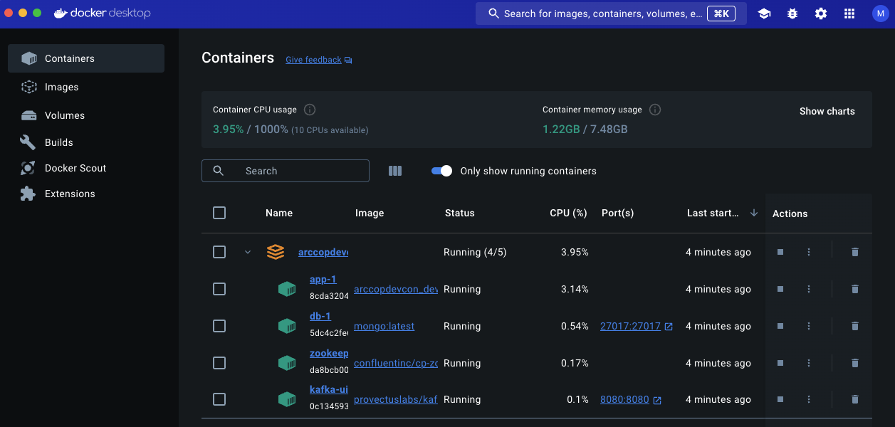

# Crate The Real Thing 

- Add Kafka
- Change Database to MongoDB

> Hey Copilot add Kafka and Monge DB to the DockerComopse file.

## New .devcontainer Setup

## finally() { [ENV.exists() => true;](04.md) }